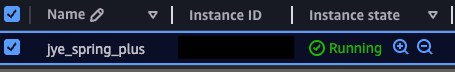
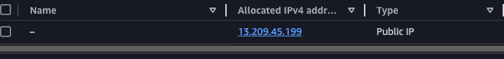
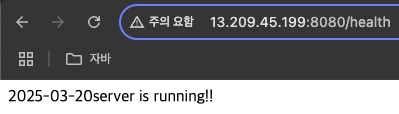
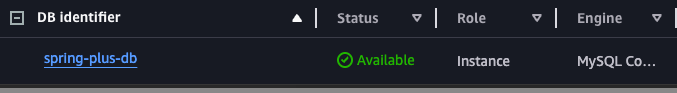
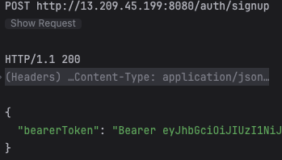
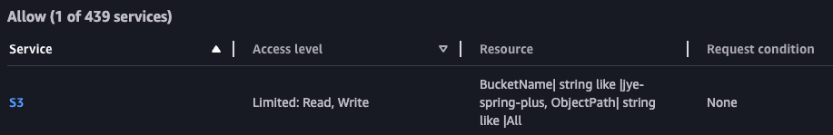
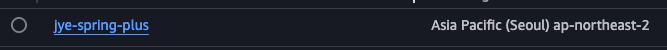
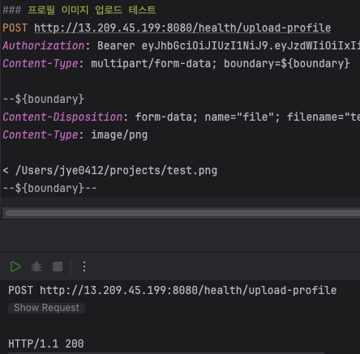
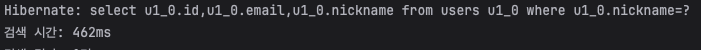
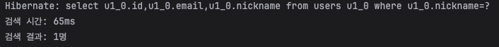

# SPRING PLUS

### 12. AWS 활용
#### 12-1. EC2
- EC2 인스턴스에서 어플리케이션을 실행하세요.




- 탄력적 IP를 설정해서 외부에서도 접속할 수 있도록 해주세요.



  
- 서버 접속 및 Live 상태를 확인할 수 있는 health check API를 만들고 `README.md` 에 기재하세요.
    - health check API는 누구나 접속 가능해야 해요.
    - API path는 편하게 정해도 괜찮습니다.
  
주소 : http://13.209.45.199:8080/health   
    - 


#### 12-2. RDS
- RDS에 데이터베이스를 구축하고, EC2에서 실행되는 어플리케이션에 연결하세요.

- RDS 연동 



- 회원가입 성공



#### 12-3. S3

- S3 버킷을 생성하여 유저의 프로필 이미지 업로드 및 관리 API를 구현하세요.

  - iam설정 (s3 권한 부여)

  

  - s3설정
- 

  - 이미지 업로드 테스트 
- 

### 13. 대용량 데이터 처리
- 대용량 데이터 처리 실습을 위해, *테스트 코드*로 유저 데이터를 100만 건 생성해주세요.
  - 데이터 생성 시 닉네임은 랜덤으로 지정해주세요.
  - 가급적 동일한 닉네임이 들어가지 않도록 방법을 생각해보세요.
  
```java
    // 100만건 데이터 생성
    private static final int BATCH_SIZE = 10000;

    @BeforeEach
    void setData() {
        List<User> userList = new ArrayList<>();

        for (int i = 0; i < 1_000_000; i++) {
            String email = "email" + i+"@gmail.com";
            String nickname = "nickname" + i;
            String password = "password";

            User user = new User(email, password, UserRole.ROLE_USER, nickname);
            userList.add(user);

            // 저장
            if (userList.size() % BATCH_SIZE == 0) {
                userRepository.saveAll(userList);
                userList.clear(); // 저장 후 리스트 비우기
            }
        }

    }
```

- 닉네임을 조건으로 유저 목록을 검색하는 API를 만들어주세요.
  - 닉네임은 정확히 일치해야 검색이 가능해요.
```java
// 닉네임이 일치하는 경우 검색

    public List<UserSearchResponse> findUserByNickName(String nickname) {
  QUser user = QUser.user;
  BooleanBuilder builder = new BooleanBuilder();

  if(nickname != null) {
    builder.and(user.nickname.eq(nickname));
  }

  return jpaQueryFactory
          .select(new QUserSearchResponse(user.id, user.email, user.nickname))
          .from(user)
          .where(builder)
          .fetch();
}
```

- 여러가지 아이디어로 유저 검색 속도를 줄여주세요.
  - 조회 속도를 개선할 수 있는 여러 방법을 고민하고, 각각의 방법들을 실행해보세요.
  - `README.md` 에 각 방법별 실행 결과를 비교할 수 있도록 최초 조회 속도와 개선 과정 별 조회 속도를 확인할 수 있는 표 혹은 이미지를 첨부해주세요.

- 적용 전 속도

  

- 인덱스 적용
```java
// 테스트코드에서 인덱스 설정
    @BeforeEach
    void setIndex() {
        try (Connection connection = dataSource.getConnection();
             Statement statement = connection.createStatement()) {

            statement.execute("CREATE INDEX idx_nickname ON users(nickname)");

        } catch (Exception e) {
            throw new RuntimeException("오류 발생: " + e.getMessage());
        }
    }
```
- 적용 후 속도

